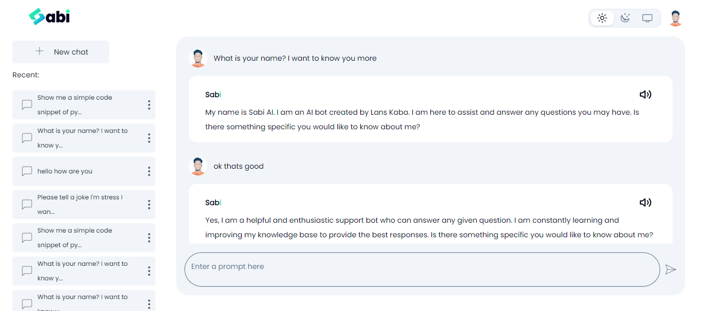
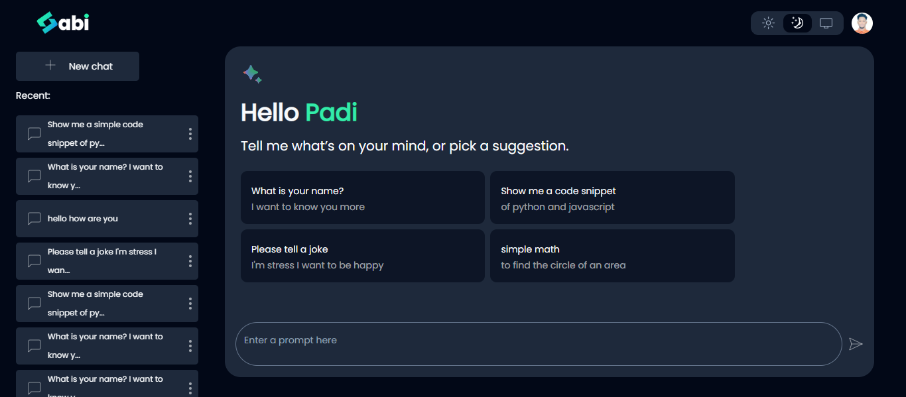
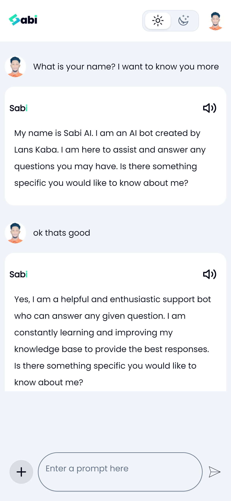
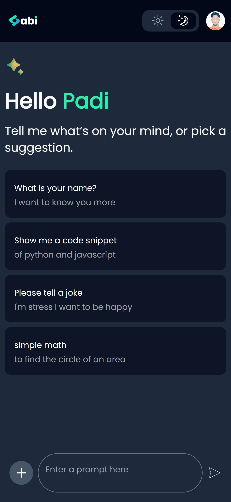

# SabiAI - Your Ultimate AI Assistant

## Introduction

Welcome to SabiAI, your go-to AI assistant designed to elevate your digital experience. SabiAI seamlessly integrates advanced conversational abilities, extensive knowledge access, and powerful code generation to become your all-encompassing virtual companion.

## Features

- **Versatility Unleashed:** SabiAI is your all-encompassing conversational companion. From information retrieval to brainstorming, SabiAI adapts to your needs, ensuring every conversation is uniquely tailored to you.

- **CInfinite Knowledge at Your Fingertips:** Dive into a sea of knowledge with SabiAI's vast understanding of various subjects. Access accurate and up-to-date information effortlessly, making SabiAI your go-to source for insights and answers.

- **TCode Generation Capabilities:** Empower your projects with SabiAI's code generation prowess. Whether you need quick snippets or assistance in complex programming tasks, SabiAI streamlines the coding process, making it a valuable ally for developers and tech enthusiasts alike..
- **Store :** All chats are stored and in the database

## Installation

Follow these steps to get started:

1. Clone the repository: `https://github.com/kabadev/sabiAi.git`
2. Navigate to the project directory: `cd your-repo`
3. Install dependencies: `npm install`
4. Environment Variables
   Ensure you have the following environment variables set up:

```env
HUGGING_FACE_TOKEN=XXXX
UPLOADTHING_SECRET=XXXX
UPLOADTHING_APP_ID=XXXX
OPENAI_API_KEY=XXXX
NEXT_PUBLIC_CLERK_PUBLISHABLE_KEY=XXXX
CLERK_SECRET_KEY=XXXX
NEXT_PUBLIC_CLERK_SIGN_IN_URL=/sign-in
NEXT_PUBLIC_CLERK_SIGN_UP_URL=/sign-up
NEXT_PUBLIC_CLERK_AFTER_SIGN_IN_URL=/dashboard
NEXT_PUBLIC_CLERK_AFTER_SIGN_UP_URL=/dashboard
MONGO_URL=XXXX

```

Replace XXXXXXX with your actual keys and URLs.

5. Run the application: `npm run dev`

## Screenshot

| Desktop Light Mode                               | Desktop Dark Mode                               |
| ------------------------------------------------ | ----------------------------------------------- |
|  |  |

| Mobile Light Mode                               | Mobile Dark Mode                               |
| ----------------------------------------------- | ---------------------------------------------- |
|  |  |

Thank you
